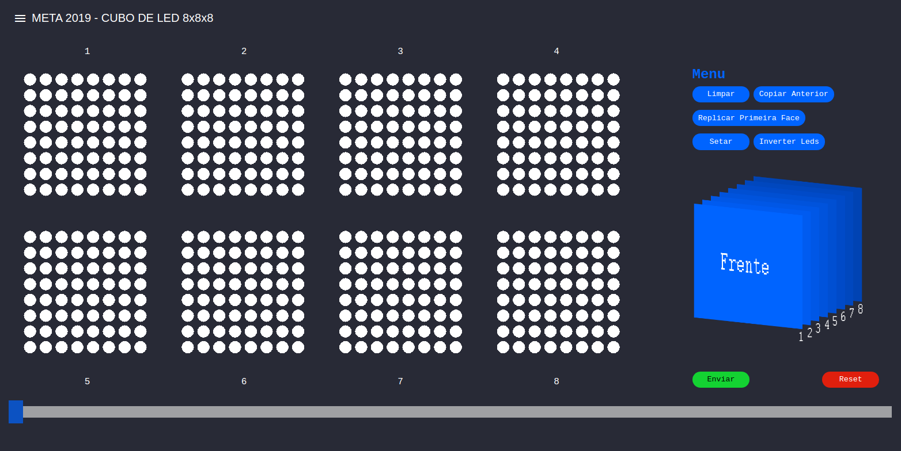

## Implementação da interface humano-máquina interativa 

Essa interface foi construída utilizando-se o framework Angular e a biblioteca gráfica p5.js para as animações e geometria.

O software captura eventos de mouse e teclado para interagir com os componentes visuais. Ao clicar sobre um LED **x** com o ponteiro do mouse, o software captura as coordenadas do clique, e baseando se na matriz de faces e na matriz de leds que cada face possui, calcula qual indíce do vetor de LED's o LED **x** corresponde e altera seu estado. Conhecimentos de geometria 2d foram utilizados para tal.

O processo de cálculo do índice é feito por:

```javascript
let xq: number = Math.floor( x / ( width / 4 ));    // x é o x do mouse
let yq: number = Math.floor( y / ( height / 2 ));   // y é o y do mouse

// [...] Verificações de range do valor

let largura: number = width / 40;
let altura: number = height / 20; 


let index = (  Math.floor( xq + yq * max    / 2 ) * max * max ) 
          + (  Math.floor(( x - xq * width  / 4 ) / ( largura )))
          + (( Math.floor(( y - yq * height / 2 ) / ( altura )) - 1 ) * max ) 
          - 1;

```

