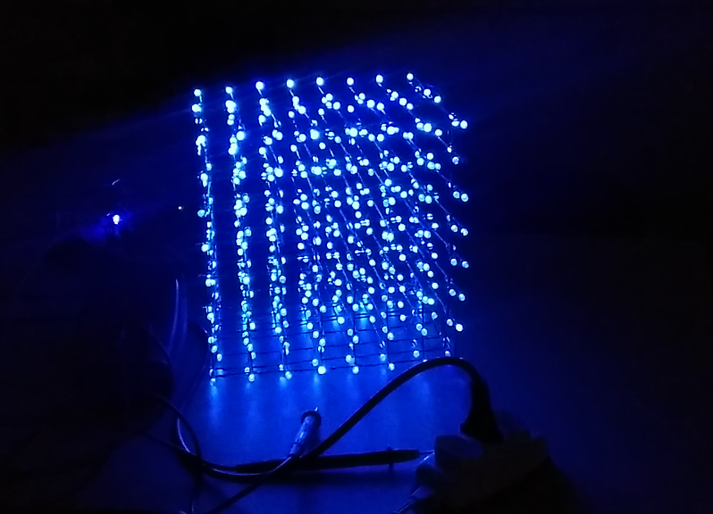
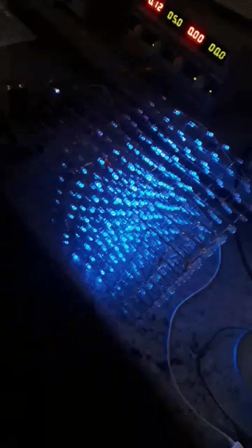

# Cubo de LED 8x8x8

Esse foi trabalho da disciplina de microcontroladores, com o objetivo de projetar e montar um Cubo de led 8x8x8.

# Imagens 

<table>
    <tr>
        <td>
        <td>
    <tr>
        <td>
    <tr>
        <td>
</table>